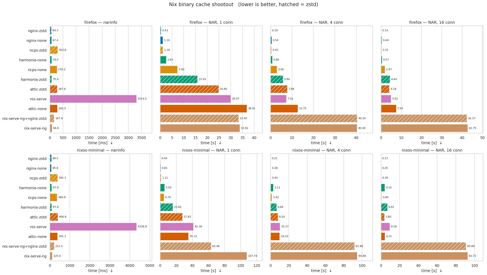

# cache-shootout



Criterion benchmark comparing Nix binary cache servers over raw HTTP
(narinfo + NAR download, sequential and concurrent).

Servers under test:

- [harmonia](https://github.com/nix-community/harmonia)
- [nix-serve](https://github.com/edolstra/nix-serve) (perl/starman)
- [nix-serve-ng](https://github.com/aristanetworks/nix-serve-ng)
- [ncps](https://github.com/kalbasit/ncps) (proxying a local upstream,
  measured warm)
- nix-serve-ng behind [nginx](https://nginx.org/) with on-the-fly zstd
  transfer encoding
- [nginx](https://nginx.org/) (static flat-file `file://` cache; `none` and
  `zstd` NAR compression)
- [attic](https://github.com/zhaofengli/attic) (sqlite + local storage,
  closure pushed up-front; `none` and `zstd`)
- [minio](https://github.com/minio/minio) /
  [rustfs](https://github.com/rustfs/rustfs) (S3 object store holding a
  `nix copy --to s3://` cache, bucket made anonymously readable; `none`
  and `zstd`)
- [snix](https://snix.dev/) (`snix-store copy` → on-disk castore →
  `nar-bridge`, closure pushed up-front)

Each server is built from its own upstream flake (see `flake.nix` inputs),
so `nix flake update <input>` bumps an individual implementation.

## What is measured

For every (closure × server) pair the harness brings the server up, resolves
all narinfos, and does **one warm-up download of every NAR** so lazy caches
(ncps) are populated and the page cache is hot. Criterion then measures:

- **narinfo** — wall time to `GET /<hash>.narinfo` for every path in the
  closure, sequentially over a single keep-alive connection. Proxy for
  metadata latency / per-request overhead.
- **NAR, N conn** — wall time to download every NAR in the closure once,
  with N workers pulling from a shared work queue (each worker on its own
  keep-alive connection). The body is streamed and discarded; the client
  never decompresses.

The chart shows the criterion **mean** of 10 samples. Bars are coloured per
implementation; **hatched = zstd** variant of the same implementation.
Because the unit is seconds, hatched and solid bars are directly comparable.

### Compression variants

| variant | what zstd means |
|---|---|
| `nginx-zstd` | `nix copy --to file://…?compression=zstd`, nginx serves `.nar.zst` off disk |
| `ncps-zstd` | ncps proxying that nginx-zstd cache, so it stores/serves `.nar.zst` |
| `attic-zstd` | atticd configured with `compression.type = "zstd"` chunk storage |
| `harmonia-zstd` | client sends `Accept-Encoding: zstd`, harmonia compresses the NAR stream on the fly |
| `snix-zstd` | client sends `Accept-Encoding: zstd`, nar-bridge compresses the NAR stream on the fly |
| `minio-zstd` / `rustfs-zstd` | `nix copy --to s3://…?compression=zstd`, object store serves `.nar.zst` |
| `nix-serve-ng+nginx-zstd` | nginx reverse-proxy in front of nix-serve-ng, `zstd on;` filter |

### Caveats

- Loopback only: no network latency or bandwidth cap, so on-the-fly
  compression looks strictly worse than it would over a real link.
- All server instances stay up for the whole run and share the machine.
- `nix-serve` runs starman with 8 workers; everything else uses its
  defaults.
- For ncps the upstream fetch is excluded by the warm-up pass.

## Committed results

| | |
|---|---|
| CPU | AMD EPYC 7713P, 64 cores / 128 threads |
| RAM | 991 GiB |
| OS | NixOS 25.11 (Xantusia), Linux 6.8.0 |
| Nix | 2.30.0pre |
| Storage | ZFS on Dell Ent NVMe AGN MU AIC 1.6 TB; `/nix/store`, `/scratch`, `/tmp` all on this pool (no tmpfs) |

All servers and the benchmark client run on this machine over loopback. The
closure is hot in ARC/page cache after the warm-up pass, so results reflect
CPU and software overhead rather than disk bandwidth.

Workload closures:

| name | paths | NAR (none) | NAR (zstd) |
|---|---|---|---|
| firefox | 373 | 1541 MiB | ~520 MiB |
| nixos-minimal | 493 | 1033 MiB | ~420 MiB |

Artefacts in [`results/`](results/):

- `shootout.png` — the chart above.
- `shootout.csv` — flat `(closure, metric, server, time_s)` table.
- `bench.log` — raw `cargo bench` output.

## Run

```sh
nix develop -c cargo bench
nix develop -c python3 scripts/plot.py --out results/shootout.png --csv-out results/shootout.csv
```

HTML report: `target/criterion/report/index.html`.

## Knobs

- `BENCH_SERVERS` — comma-separated server names (e.g.
  `harmonia-none,snix,minio-zstd`); unset = all.
- `BENCH_CLOSURES` — comma-separated closure names
  (default: `firefox,nixos-minimal`). Each name resolves to
  `.#packages.<system>.closure-<name>`; a literal flake ref containing `#`
  is used as-is.
- `*_BIN` — absolute paths to each server binary, set by the devShell so the
  harness runs the exact upstream-flake builds regardless of `PATH`.
